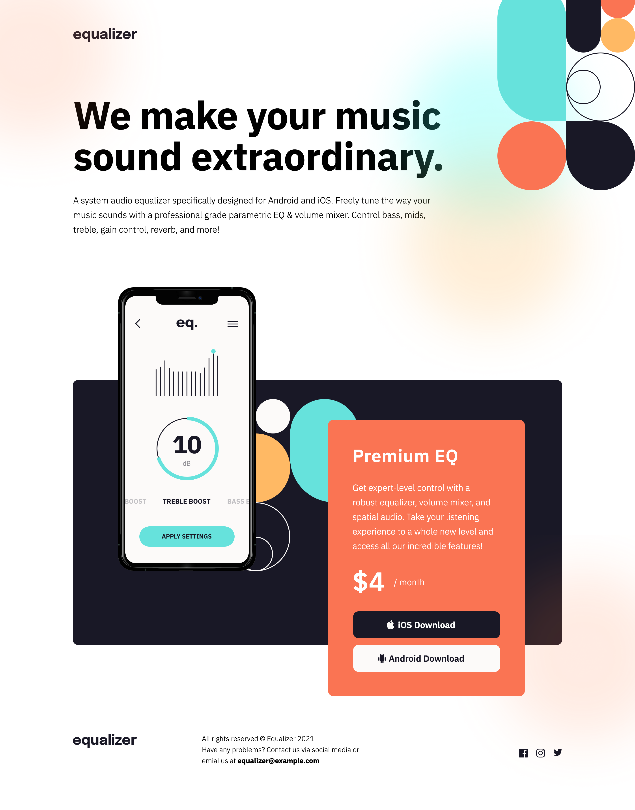

# Frontend Mentor - Equalizer landing page solution

This is a solution to the [Equalizer landing page challenge on Frontend Mentor](https://www.frontendmentor.io/challenges/equalizer-landing-page-7VJ4gp3DE). Frontend Mentor challenges help you improve your coding skills by building realistic projects.

## Table of contents

- [Overview](#overview)
  - [The challenge](#the-challenge)
  - [Screenshot](#screenshot)
  - [Links](#links)
- [My process](#my-process)
  - [Built with](#built-with)
  - [What I learned](#what-i-learned)
  - [Continued development](#continued-development)
- [Author](#author)

## Overview

### The challenge

Users should be able to:

- View the optimal layout depending on their device's screen size
- See hover states for interactive elements

### Screenshots

### Links

- Solution URL: [Add solution URL here](https://github.com/Jaumet91/Equalizer-landing-page)
- Live Site URL: [Add live site URL here](https://jaumet91.github.io/Equalizer-landing-page/)

## My process

### Built with

- Desktop-first workflow
- [React](https://reactjs.org/) - JS library
- [SASS](https://sass-lang.com/) - SASS Preprocessor

### What I learned

This is my first project using SASS, I tried to make a "pixel perfect" replica in all devices. It was a hard challenge but I'm happy with the overall page.

### Continued development

It migh be a better way to organize the layout and do the responsive, also I will find a better way to manage the responsiveness of central div in the footer section.

## Author

- Frontend Mentor - [@Jaumet91](https://www.frontendmentor.io/profile/Jaumet91)
- Twitter - [@Jaumet_GG](https://twitter.com/Jaumet_GG)
